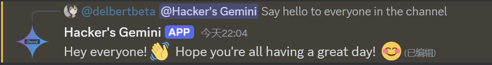

<p align="center"></p>

## Discord Gemini Bot 🤖

### Features

<p align="center"></p>

- [x] 😀 Chat using texts
- [x] 👋🏼 Chat with context
- [x] 🥷🏼 Clear context with `/clear` command
- [x] 🚀 Streaming output
- [ ] Multimodal support

### Development & Deploy

#### Prepare

##### Making APIs Ready

1. Get Discord API Key and Client ID via : https://discord.com/developers/applications
   1. If you do not have a bot, just create one.
   2. After create, click `Bot` in the nav.
   3. In `Privileged Gateway Intents`, enable following permissions:
      1. `Presence Intent`
      2. `Server Members Intent`
      3. `Message Content Intent`
2. Get Gemini API Key via: https://aistudio.google.com/app/apikey

##### Add Gemini bot to your Discord Server

1. Open https://discord.com/developers/applications and select the bot you just created.
2. Click `OAuth2` in the nav.
3. In `OAuth2 URL Generator`, check the following options:
   1. `bot`
   2. `applications.commands`
4. In `Bot Permissions`, check the following options:
   1. `Send Messages`
   2. `Create Public Threads`
   3. `Manage Messages`
   4. `Embed Links`
   5. `Attach Files`
   6. `Read Message History`
   7. `Mention Everyone`
   8. `Use Slash Commands`
   9. `View Channels`
5. `Integration Type` choose `Guild Install`
6. Copy the `Generated URL` and open it in your browser, now you can add it into your discord server.

#### Development Guide

##### Get the codes

This project is written in TypeScript, before deploy, ensure you have NodeJS (>= v20 is recommended) installed. If you don't have NodeJS, [fnm](https://github.com/Schniz/fnm) is the NodeJS installer recommended.

```bash
git clone https://github.com/delbertbeta/discord-gemini-bot.git
cd discord-gemini-bot
npm i
```

Then replace your key into `.env` file, reminder to keep these keys safely and **DO NOT** upload this file to public place.

```bash
cp .env.example .env
```

##### Configure i18n (Optional)

You can change the language used by the bot user interface by setting the environment variable `LANG`. This variable has probably already been set by your operating system, but you can give a custom value in the `.env` file to serve users with different language preferences. Note that the value must begin with one of the filenames of the JSON files under `src/i18n`.

Although localized prompt is given to the AI model initially, this setting does not guarantee that it will respond with the same language, you can still get responses in any language if you ask the model to do so.

##### Run development server

```js
npm run dev
```

You will see this output if everthing is working fine: `Bot is ready!`.

**The Bot only works if your process is running which means if you stop the process then the bot won't give you response.**

#### Deploy

You can choose one of the methods to deploy the bot.

##### Use source code

1. Follow the way in [Get the code](#get-the-codes), **REMIND to place your `.env` file correctly**.
2. Instead of launching the development server, run following command to build a production ready artifact.

```
npm run build
```

3. run `npm run start` to run your server
4. To make the bot server as a background service, use `systemd`, `tmux`, `screen` and etc.
   1. Repo has provided a example `systemd` service file `discord-gemini-bot.service`.
   2. Copy the sample `discord-gemini-bot.service` to `/etc/systemd/system/discord-gemini-bot.service`.
   3. Modify the parameters in the service file.
   4. run `sudo systemctl enable discord-gemini-bot --now` to enable and start the service.
   5. use `sudo systemctl status discord-gemini-bot` to check the health status of the service.

##### Use docker

1. Initially create and start container

```
docker pull delbertbeta/discord-gemini-bot:main
docker run \
   -d \
   --restart=always \
   --name=discord-gemini-bot \
   --env=DISCORD_API_KEY=$DISCORD_API_KEY \
   --env=DISCORD_CLIENT_ID=$DISCORD_CLIENT_ID \
   --env=GEMINI_API_KEY=$GEMINI_API_KEY \
   delbertbeta/discord-gemini-bot:main
```

**REPLACE the `$DISCORD_API_KEY`, `$DISCORD_CLIENT_ID`, `$GEMINI_API_KEY` in the command or create these env variables**

2. Use `docker ps` and `docker logs discord-gemini-bot` to check the health status of the service.
3. Upgrade

```
docker pull delbertbeta/discord-gemini-bot:main
docker stop discord-gemini-bot
docker rm discord-gemini-bot
docker run \
   -d \
   --restart=always \
   --name=discord-gemini-bot \
   --env=DISCORD_API_KEY=$DISCORD_API_KEY \
   --env=DISCORD_CLIENT_ID=$DISCORD_CLIENT_ID \
   --env=GEMINI_API_KEY=$GEMINI_API_KEY \
   delbertbeta/discord-gemini-bot:main
```

Congrats on making your own Gemini Bot.

### Thanks

- [Bibekdhkl/Gemini-discord-bot](https://github.com/Bibekdhkl/Gemini-discord-bot)
